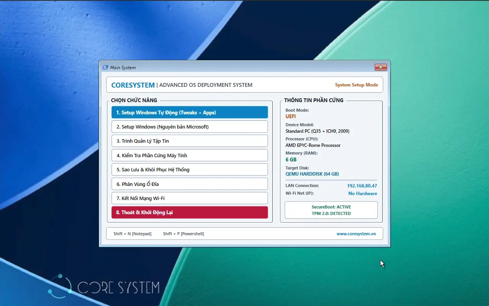

### OSDCloud

A pet project by [CoreSystem](https://www.coresystem.vn) with the aim of helping IT admins deploy business-grade Windows 11 installations with the following criteria:

- Always deploy from **clean, official Microsoft sources** with the latest updates.
- Total installation time wrapped up **within 30-45 minutes** (depending on Internet bandwidth).
- **Enterprise-ready** automation customization: Bloatware removal out-of-the-box, alongside pre-installing essential office applications.
- **Maximum compatibility with modern hardware security standards** as vendors tighten enforcement on UEFI firmware, SecureBoot, and TPM 2.0 chips.
- Beyond its primary deployment capabilities, the boot system integrates essential utilities for hardware diagnostics, partition management, and disk backup, ensuring a safe and reliable setup process.
- **100% compliant**: The system does not utilize any commercial software that could potentially trigger corporate licensing or legal disputes.
- Suited for a **wide range of hardware** from vendors like HP, Dell, Lenovo...

The birth of this system would not have been possible without the [OSDCloud platform](https://www.osdeploy.com), the autounattended.xml generator by expert [Christoph Schneegans](https://schneegans.de/christoph), as well as the relentless support of [Gemini](https://gemini.google.com) in optimizing the automation logic and codebase.

Please refer to the [WIKI section](https://github.com/coresystemvn/OSDCloud/wiki) of this repository for step-by-step instructions on building your own bootable media.


****🔰 Business Environment Test Cases 🔰****


✅ OS Installation, local admin password configuration, computer renaming, Active Directory domain joining, and Group Policy application (PASSED).

✅ OS Installation, local admin password configuration, computer renaming, EntraID joining, and Bitlocker encryption with online recovery key storage (PASSED).

✅ Supports booting via USB/DVD as well as specialized PXE deployment environments (e.g., WDS - Windows Deployment Services).

✅ Multidrive performs flawlessly during disk/partition backup and restore under a Bitlocker-encrypted PE environment.

✅ Bitlocker drive decryption for file manipulation via Explorer++ using:

```
manage-bde -Unlock C: -RecoveryPassword 'your-48-digit-key'
```

****🚨 Additional Notes 🚨****

🧱 In corporate networks with firewalls, deployment might encounter minor hiccups. During the Post-setup phase, the system needs to fetch applications from the Microsoft/Windows Store, GitHub, and official vendor repositories. Ensure your firewall policies (Application Control) permit connections to these endpoints (PASSED).

🧱 For optimal performance, it is highly recommended to isolate the deployment system within a dedicated VLAN with direct Internet access. This prevents broadcast traffic from disrupting the production network and ensures that strict firewall rules do not interfere with or break the cloud-based installation process.

Main Interface



Video Demo

https://coresystem.vn/images/blog/vid.mp4